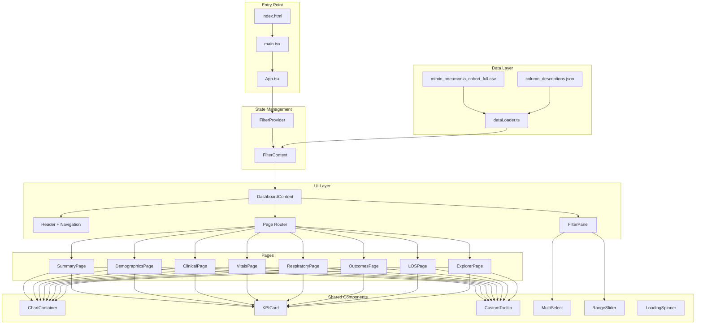
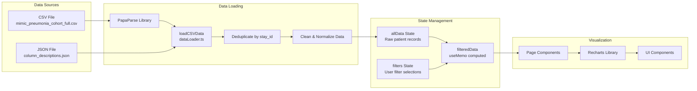
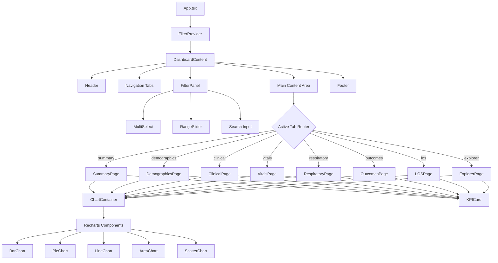
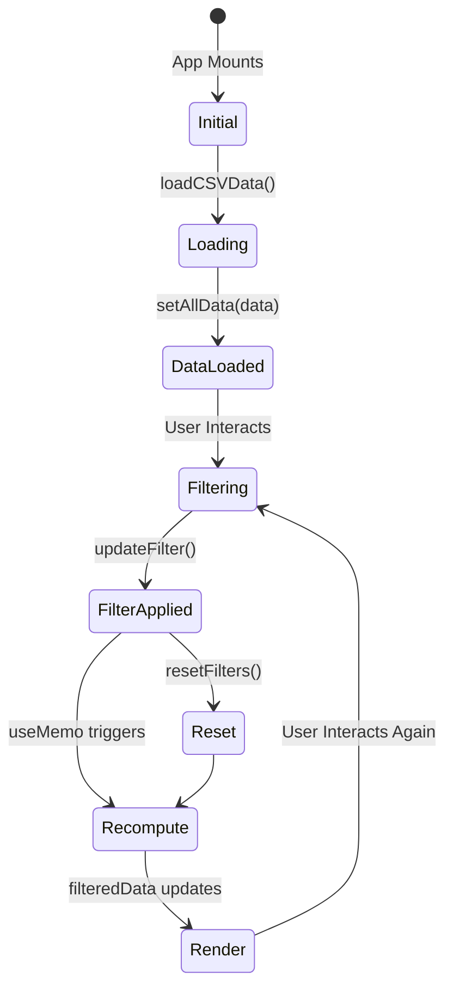
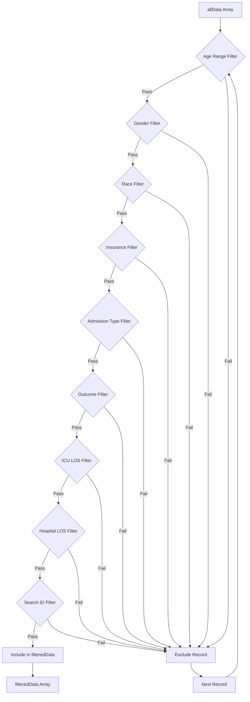
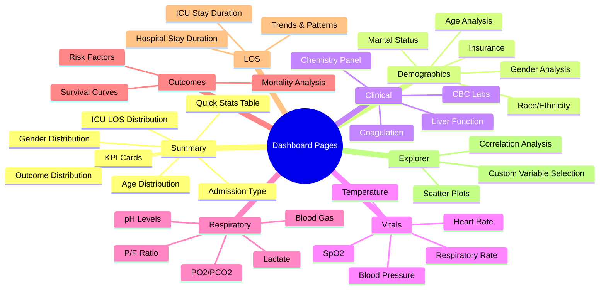
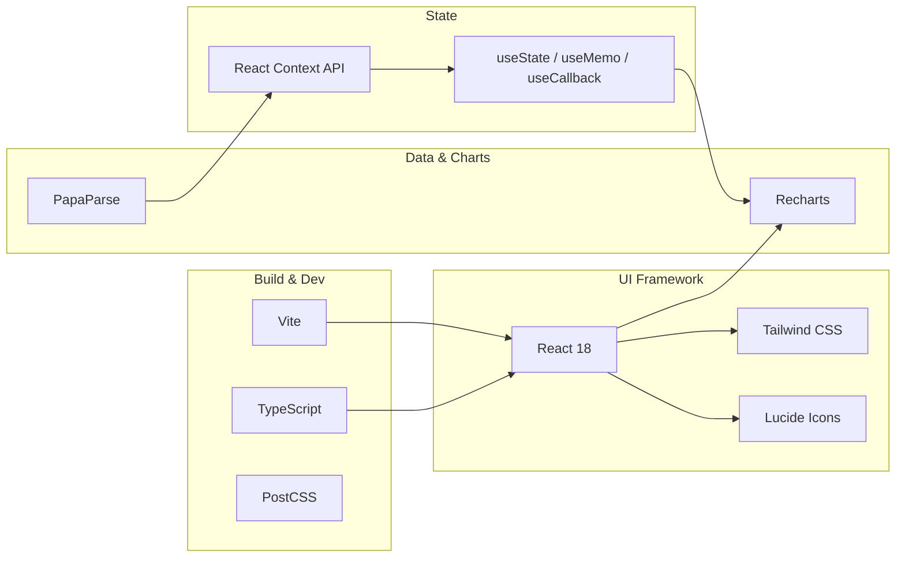
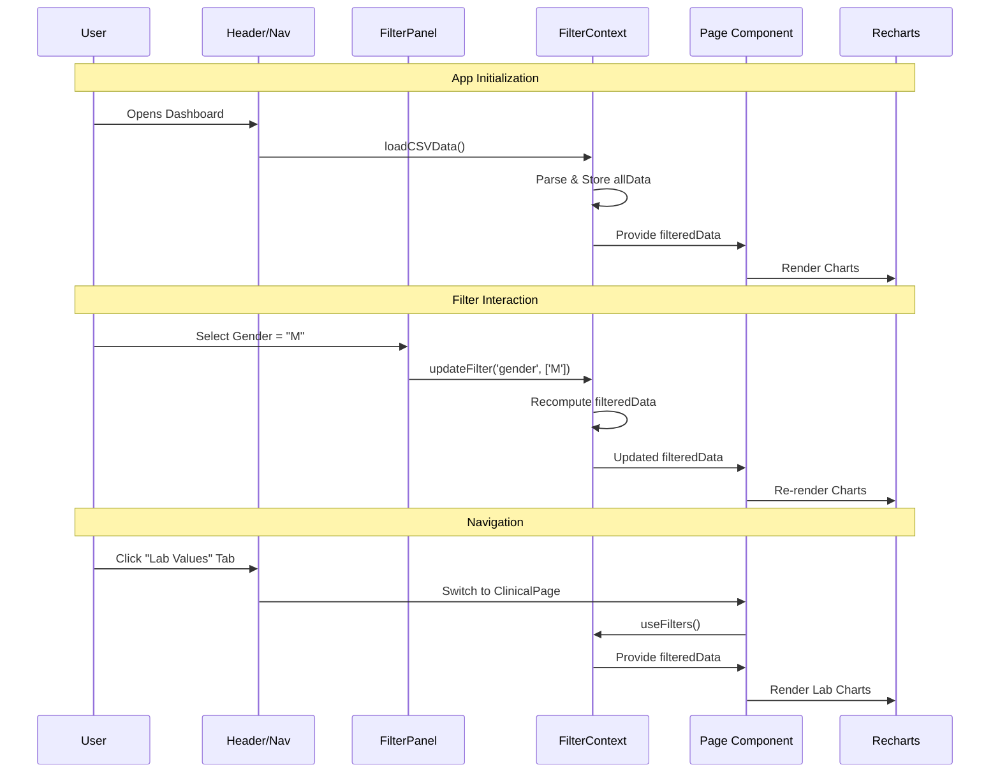
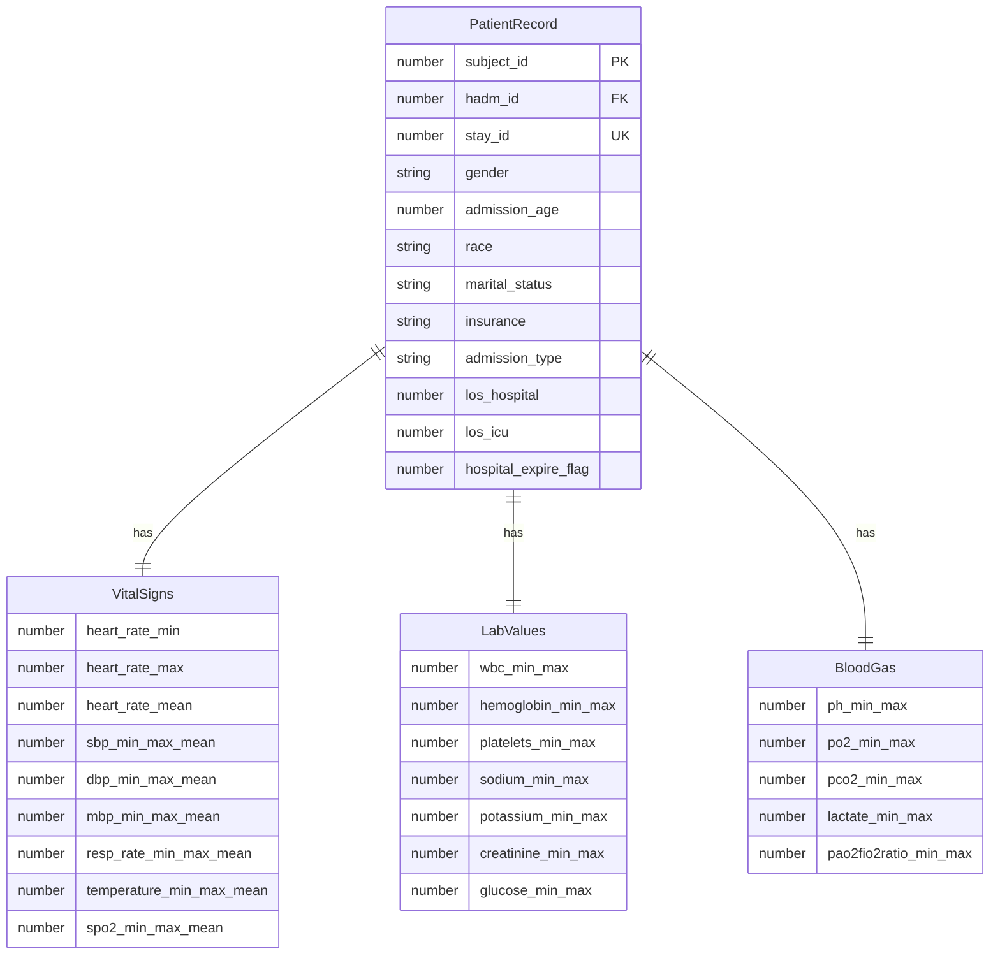
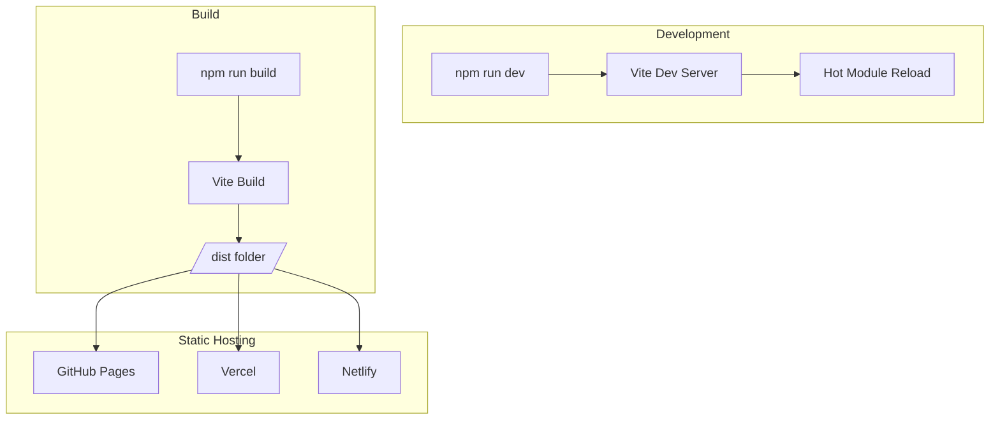

# MIMIC-IV Pneumonia ICU Dashboard - Architecture & Workflow

This document provides structured diagrams and descriptions for LLM-based diagram generation tools.

---

## 1. High-Level System Architecture



---

## 2. Data Flow Diagram



---

## 3. Component Hierarchy



---

## 4. State Management Flow (FilterContext)



---

## 5. Filter Logic Flow



---

## 6. Page Responsibility Matrix



---

## 7. Technology Stack



---

## 8. File Structure Map

```
dashboard/
├── index.html                 # HTML entry point
├── vite.config.ts             # Vite configuration
├── tailwind.config.js         # Tailwind CSS config
├── tsconfig.json              # TypeScript config
├── package.json               # Dependencies
│
├── public/
│   ├── mimic_pneumonia_cohort_full.csv  # Patient data
│   └── column_descriptions.json          # Metadata
│
└── src/
    ├── main.tsx               # React entry point
    ├── App.tsx                # Root component + routing
    ├── index.css              # Global styles
    │
    ├── types/
    │   └── index.ts           # TypeScript interfaces
    │
    ├── context/
    │   └── FilterContext.tsx  # Global state management
    │
    ├── utils/
    │   └── dataLoader.ts      # Data loading & utilities
    │
    ├── components/
    │   ├── charts/
    │   │   ├── ChartContainer.tsx   # Chart wrapper
    │   │   └── CustomTooltip.tsx    # Chart tooltips
    │   ├── filters/
    │   │   ├── FilterPanel.tsx      # Main filter UI
    │   │   ├── MultiSelect.tsx      # Multi-select dropdown
    │   │   └── RangeSlider.tsx      # Range input
    │   └── ui/
    │       ├── KPICard.tsx          # Metric cards
    │       ├── LoadingSpinner.tsx   # Loading states
    │       └── Tooltip.tsx          # Info tooltips
    │
    └── pages/
        ├── SummaryPage.tsx      # Overview dashboard
        ├── DemographicsPage.tsx # Demographics analysis
        ├── ClinicalPage.tsx     # Lab values
        ├── VitalsPage.tsx       # Vital signs
        ├── RespiratoryPage.tsx  # Blood gas analysis
        ├── OutcomesPage.tsx     # Mortality outcomes
        ├── LOSPage.tsx          # Length of stay
        └── ExplorerPage.tsx     # Custom exploration
```

---

## 9. User Interaction Sequence



---

## 10. Data Schema (PatientRecord Interface)



---

## 11. Deployment Architecture



---

## Quick Reference for LLM Tools

### For Diagram Generation Prompts:

1. **Architecture Diagram**: "Create a system architecture showing React app with FilterContext state, 8 page components, and Recharts visualization layer"

2. **Data Flow**: "Draw data flow from CSV file through PapaParse, to FilterContext state, filtered by user selections, rendered via Recharts"

3. **Component Tree**: "Generate React component hierarchy: App → FilterProvider → DashboardContent → [Header, FilterPanel, Pages] → [Chart/KPI Components]"

4. **State Machine**: "Create state diagram for filter workflow: Initial → Loading → DataLoaded → Filtering ↔ FilterApplied → Render"

### Key Relationships:
- `FilterProvider` wraps entire app (global state)
- `useFilters()` hook accesses context in any component
- `filteredData` is memoized, recomputes on filter changes
- All pages consume same `filteredData` from context
- Recharts components receive data as props from pages

